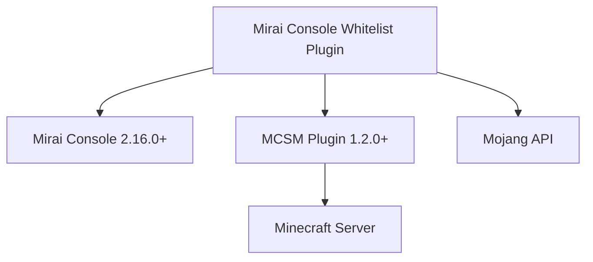
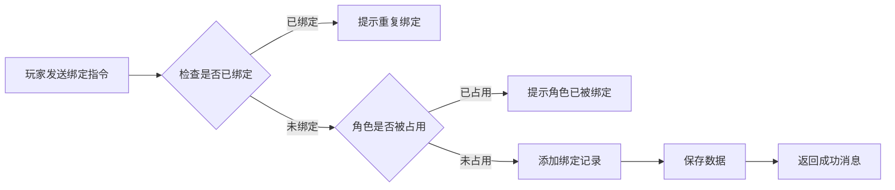
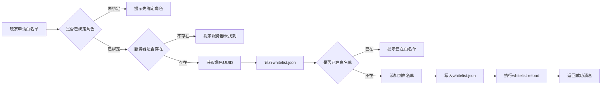

# Mirai Console Whitelist Plugin

[](LICENSE)
[](https://github.com/limbang/mirai-console-whitelist-plugin)
[](https://kotlinlang.org/)
[](https://github.com/mamoe/mirai-console)

一个基于 [Mirai Console](https://github.com/mamoe/mirai-console) 的 Minecraft 服务器白名单管理插件，通过 QQ 群消息实现便捷的角色绑定和白名单管理功能。

## ✨ 功能特性

- 🔗 **QQ 与 MC 角色绑定** - 支持正版和外置登录角色绑定
- 📝 **白名单申请** - 玩家可通过 QQ 群自助申请加入白名单
- 👥 **白名单管理** - 管理员可查询、删除白名单成员
- 🔍 **角色查询** - 快速查询已绑定角色的 QQ 账号
- 🌐 **多服务器支持** - 配合 MCSM 插件管理多个 Minecraft 服务器
- 💾 **自动保存** - 绑定数据自动持久化存储

## 📋 前置要求

- [Mirai Console](https://github.com/mamoe/mirai-console) 2.16.0+
- [Mirai Console MCSM Plugin](https://github.com/limbang/mirai-console-mcsm-plugin) 1.2.0+
- Kotlin 2.0.0+
- Minecraft 服务器（支持 whitelist.json 文件格式）

## 🚀 安装方法

### 1. 下载插件

从 [Releases](https://github.com/limbang/mirai-console-whitelist-plugin/releases) 页面下载最新版本的 `.mirai2.jar` 文件。

### 2. 安装依赖

确保已安装 [mirai-console-mcsm-plugin](https://github.com/limbang/mirai-console-mcsm-plugin) 并正确配置。

### 3. 部署插件

将下载的 `mirai-console-whitelist-plugin-*.mirai2.jar` 文件放入 Mirai Console 的 `plugins` 目录：

```bash
cp mirai-console-whitelist-plugin-*.mirai2.jar /path/to/mirai-console/plugins/
```

### 4. 启动 Mirai Console

启动或重启 Mirai Console，插件会自动加载并生成配置文件。

## 📖 使用说明

### 玩家指令

所有玩家均可在配置的 QQ 群中使用以下指令：

#### 绑定角色

```
绑定角色 <角色名> <正版/外置>
```

**示例：**
```
绑定角色 Steve 正版
绑定角色 Alex 外置
```

**说明：**
- 每个 QQ 账号只能绑定一个角色
- 每个角色只能被一个 QQ 账号绑定
- 正版角色会验证 Mojang API
- 外置角色使用离线 UUID 生成规则

#### 申请加入白名单

```
申请加入白名单 [服务器名称]
```

**示例：**
```
申请加入白名单 SurvivalServer
```

**说明：**
- 必须先绑定角色才能申请
- 服务器名称需在 MCSM 插件中配置
- 申请成功后会自动添加到服务器的 `whitelist.json` 并刷新白名单

### 管理员指令

需要相应权限才能使用的管理指令：

#### 解绑角色

```
解绑角色 <角色名>
```

**示例：**
```
解绑角色 Steve
```

#### 删除白名单

```
删除白名单 <服务器名称> <角色名>
```

**示例：**
```
删除白名单 SurvivalServer Steve
```

#### 查询白名单

```
查询白名单 [服务器名称]
```

**示例：**
```
查询白名单 SurvivalServer
```

**输出示例：**
```
[SurvivalServer]白名单如下：

Steve - 550e8400
Alex - 6ba7b810
Notch - 069a79f4
```

#### 查询角色绑定

```
查询角色 <角色名>
```

**示例：**
```
查询角色 Steve
```

**输出示例：**
```
角色 Steve [正版] 的 QQ 绑定为：123456789,@123456789
```

## ⚙️ 配置文件

插件配置文件位于 `data/top.limbang.whitelist/whitelist.yml`：

```yaml
# 绑定列表
bindingList:
  - qq: 123456789
    username: "Steve"
    isOfficial: true
  - qq: 987654321
    username: "Alex"
    isOfficial: false
```

### 配置项说明

| 字段 | 类型 | 说明 |
|------|------|------|
| `qq` | Long | QQ 号码 |
| `username` | String | Minecraft 角色名 |
| `isOfficial` | Boolean | 是否为正版账号（true=正版，false=外置） |

## 🔧 权限配置

插件使用 Mirai Console 的权限系统，可在 `config/Console/PermissionService.yml` 中配置权限：

```yaml
permissions:
  top.limbang.whitelist.admin:
    description: "白名单插件管理员权限"
    parents:
      - mirai:admin
```

默认情况下，拥有 `mirai:admin` 权限的用户可以使用所有管理指令。

## 🏗️ 技术架构

### 依赖关系



### 工作流程

#### 绑定流程



#### 白名单申请流程



### 核心类说明

| 类名 | 职责 |
|------|------|
| `Whitelist` | 插件主类，负责初始化和生命周期管理 |
| `WhitelistData` | 数据管理类，处理绑定信息的持久化 |
| `WhitelistListener` | 事件监听器，处理所有群消息指令 |
| `UserInfo` | 用户信息实体类（QQ、角色名、正版标识） |
| `Role` | Minecraft 角色实体类（UUID、名称） |

## 🛠️ 开发指南

### 环境要求

- JDK 11+
- Kotlin 2.0.0+
- Gradle 7.1+

### 构建项目

```bash
# 克隆仓库
git clone https://github.com/limbang/mirai-console-whitelist-plugin.git
cd mirai-console-whitelist-plugin

# 构建插件
./gradlew buildPlugin

# 生成的插件位于 build/mirai/ 目录
```

### 运行测试

```bash
./gradlew test
```

### 调试模式

项目包含 `debug-sandbox` 目录，可用于本地调试：

```bash
./gradlew runMiraiConsole
```

## 📝 API 集成

### Mojang API

插件使用 Mojang API 验证正版角色并获取 UUID：

```
GET https://api.mojang.com/users/profiles/minecraft/{username}
```

**响应示例：**
```json
{
  "id": "550e8400e29b41d4a716446655440000",
  "name": "Steve"
}
```

### MCSM Plugin API

通过 MCSM Plugin 提供的 API 与 Minecraft 服务器交互：

- 读取 `whitelist.json` 文件
- 更新 `whitelist.json` 文件
- 执行服务器命令（`whitelist reload`）

## ❓ 常见问题

### Q: 绑定角色时提示"角色已被绑定"怎么办？

A: 每个角色只能被一个 QQ 账号绑定。如果确认是误绑定，请联系管理员使用 `解绑角色` 指令解除绑定。

### Q: 申请白名单后游戏中没有生效？

A: 请检查：
1. MCSM 插件是否正确配置了该服务器
2. 服务器是否正常运行
3. 查看 Mirai Console 日志是否有错误信息
4. 手动在游戏中执行 `/whitelist reload` 确认

### Q: 支持基岩版吗？

A: 本插件主要针对 Java 版 Minecraft 设计，基岩版的白名单文件格式不同，暂不支持。

### Q: 如何备份绑定数据？

A: 定期备份 `data/top.limbang.whitelist/whitelist.yml` 文件即可。

## 🤝 贡献指南

欢迎提交 Issue 和 Pull Request！

1. Fork 本仓库
2. 创建特性分支 (`git checkout -b feature/AmazingFeature`)
3. 提交更改 (`git commit -m 'Add some AmazingFeature'`)
4. 推送到分支 (`git push origin feature/AmazingFeature`)
5. 开启 Pull Request

## 📄 许可证

本项目采用 [GNU Affero General Public License v3.0](LICENSE) 许可证。

## 👤 作者

**Limbang**

- GitHub: [@limbang](https://github.com/limbang)

## 🙏 致谢

- [Mirai Console](https://github.com/mamoe/mirai-console) - 高效的 QQ 机器人框架
- [MCSM Plugin](https://github.com/limbang/mirai-console-mcsm-plugin) - Minecraft 服务器管理插件
- [Kotlin](https://kotlinlang.org/) - 现代编程语言

## 📮 联系方式

如有问题或建议，请通过以下方式联系：

- 提交 [Issue](https://github.com/limbang/mirai-console-whitelist-plugin/issues)
- 发送邮件至项目作者

---

⭐ 如果这个项目对你有帮助，请给个 Star 支持一下！
